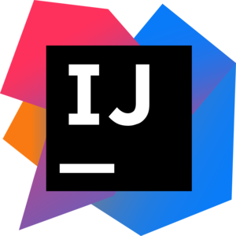

# Intellij IDEA Master - Presentation

A small and fun challenge around Jetbrains Intellij IDEA.  
The idea is to increase proficiency by mastering the keyboard and giving some tips about the editor, settings and plugins.   
For the presentation, see [index.html](index.html).  
For the keyboard shortcuts, see [SHORTCUTS.md](SHORTCUTS.md).  
I gave this presentation to my coworkers on july 2017.



## Todo

* Pictures of the prizes (yoyos, stickers)
* Add Licence

## Rules

A keyboard **championship** is given: 

* Each correct response gives a +1
* The top 3 scorers win a yoyos
* One random of the remaining player also wins a yoyo (encourage participation)

## Generating the presentation

The `index.html` is generated with [Cleaver](https://github.com/jdan/cleaver).  
Image are best at 800px wide.  

```bash
npm install -g cleaver
cleaver index.md
# Watching:
cleaver watch index.md
# Then open index.html in the browser
```

## Generating a PDF of the shortcuts

A handy PDF of the keyboard shortcuts can be generated at [markdowntopdf.com](http://www.markdowntopdf.com/) or locally with [Markdown-pdf](https://github.com/alanshaw/markdown-pdf).

```bash
npm install -g markdown-pdf
markdown-pdf SHORTCUTS.md
# `SHORTCUTS.pdf` is generated
```
