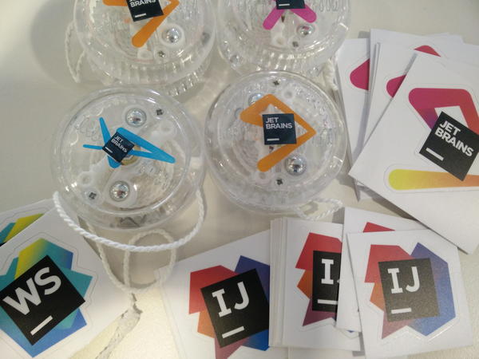

# Intellij IDEA Master - Presentation

A small and fun challenge around Jetbrains Intellij IDEA.  
The idea is to increase proficiency by mastering the keyboard and giving some tips about the editor, settings and plugins.   
For the presentation, see [index.html](index.html).  
For the keyboard shortcuts, see [SHORTCUTS.md](SHORTCUTS.md) and the generated [SHORTCUTS.pdf](SHORTCUTS.pdf).  

The "Presentation Assistant" plugin is very handy to display the keyboard shortcuts on screen.
  
I first gave this presentation to my coworkers on july 2017.


## Rules

A keyboard **championship** is given: 

* Each correct response gives a +1
* The top 3 scorers win a yoyos
* One random of the remaining player also wins a yoyo (encourage participation)

## Swag

Generously given by Jetbrains!




## Generating the presentation

The [build script](build) generate both the presentation and the list of keyboard shortcuts.

The [index.html](index.html) is generated with [Cleaver](https://github.com/jdan/cleaver).  
Image are best at 800px wide.  

```bash
npm install -g cleaver
cleaver index.md
# Watching:
cleaver watch index.md
# Then open index.html in the browser
```

The [SHORTCUTS.pdf](SHORTCUTS.pdf) is very handy to be printed. You can generate it from [SHORTCUTS.md](SHORTCUTS.md) using [markdowntopdf.com](http://www.markdowntopdf.com/) or locally with [Markdown-pdf](https://github.com/alanshaw/markdown-pdf).

```bash
npm install -g markdown-pdf
markdown-pdf SHORTCUTS.md
# `SHORTCUTS.pdf` is generated
```
