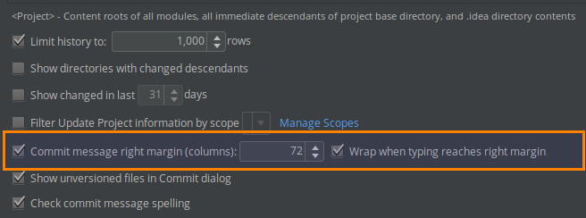

title: Intellij Master
author:
    name: "Thomas Queste"
    url: "tomsquest.com"
    email: "tom@tomsquest.com"
    twitter: "@ThomasQueste"
output: index.html
style: index.css 
controls: false
--
# Intellij Master


--
### Goals

* Master the Keyboard
* Master the Editor
* Master the Settings
* Master the Plugins
--
### Keyboard

* 1 correct answer = 1 point
* Top 3 players win a yoyo
* 1 random player wins a yoyo
* Stickers for the others
--
### Tips

* Make a list of shortcuts for later
--

--
### Ready ?


--
# Editor
--
### Postfix Completion


--
### Live template


Ctrl+J
--
### Replace instead of insert


--
### Smart Completion


Ctrl+Shift+Space
--
### Smart Enter


Ctrl+Shift+Enter
--
### Semantic highlighting


Settings → Editor → Colors & Fonts → Language Defaults → Semantic highlighting
--
### Structural Search & Replace


[Examples](https://www.jetbrains.com/help/idea/structural-search-and-replace-examples.html)

Settings → Editor → Colors & Fonts → Language Defaults → Semantic highlighting
--
### Command line launcher


Tools → Create command line launcher
--
### Auto-test


--
### Multi Find tabs


--
### Zen-Coding/Emmet


```css
div>ul>li 

<div>
    <ul>
        <li></li>
    </ul>
</div>
```
--
# Settings
--
### Coverage


--
### GIT



--
# Plugins
--
### Useful

* Key Promoter (padawan)
* Shifter: change visibility, inc/decr numbers, dates...
* Log support 2: brings logger inspection, eg. forgotten param in `log.info("foo: {}")`
--
### Trying

* Acejump: jumping around
* Sonar Lint: becoz errors
--
### Final thoughts

* Qwerty > Azerty
* Touch type
--
### Thanks

Thanks to **Varvara** from Jetbrains for the gifts

